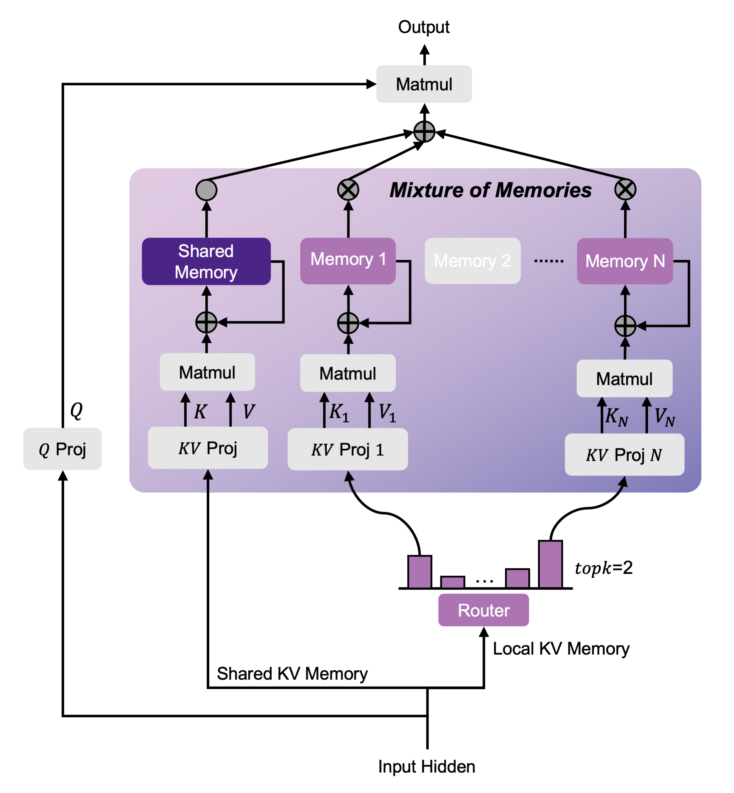

<div align="center">

# MoM: Mixture-of-Memories
[](https://arxiv.org/abs/2502.13685)
[](https://huggingface.co/linear-moe-hub)
[](https://zhuanlan.zhihu.com/p/25066090353)
[](https://github.com/OpenSparseLLMs/MoM/stargazers)

</div>

## News
- [2025-09] Implemented MoM with `varlen` to improve operator efficiency and the code has been integrated into [flash-linear-attention](https://github.com/fla-org/flash-linear-attention) repository.

Welcome to MoM! This repository provides the implementation of [MoM: Linear Sequence Modeling with Mixture-of-Memories](https://arxiv.org/abs/2502.13685), on huggingface eco-system. MoM is compatible with all kinds of linear sequence modeling methods like: linear attention, SSM, linear RNN, etc. **Here is an introductory artical about MoM (in Chinese) on [Zhihu](https://zhuanlan.zhihu.com/p/25066090353)**.

<p align="center">
  
</p>
<div align="center">
MoM Architecture
</div>

## Installation

**⭐ If you have already installed the latest `fla` repository, you can skip this step.**

The following requirements should be satisfied:
- [PyTorch](https://pytorch.org/) >= 2.5
- [Triton](https://github.com/openai/triton) >=3.0
- [einops](https://einops.rocks/)
- [transformers](https://github.com/huggingface/transformers) >=4.45.0
- [datasets](https://github.com/huggingface/datasets) >=3.3.0
- [causal-conv1d](https://github.com/Dao-AILab/causal-conv1d) >=1.4.0

Install the package from source:
```bash
pip install -e .
```

## Getting Started

### Data Preparation
Before training, make sure to preprocess your data by following the steps outlined in [training/README.md](training/README.md).

### Training From Scratch

To start training with default setup, simply run:
```bash
cd training

bash train.sh \
  nodes=4 \
  gpus=8 \
  type=mom \
  lr=3e-4 \
  steps=30720 \
  batch=8 \
  update=1 \
  warmup=1024 \
  context=2048 \
  path=SlimPajama/mom-15B \
  project=SlimPajama \
  model=configs/mom_340M.json \
  tokenizer=fla-hub/gla-1.3B-100B \
  data=SlimPajama-627B \
  cache=data/chunk1/train
```

You can also
- Modify the script to adjust the modeling and training settings.
- e.g., modify [examples/configs/mom_340M.json](examples/configs/mom_340M.json) to adjust the MoM model structure.

### Evaluation

To evaluate model checkpoints on **commonsense reasoning benchmarks**, we recommend you to run:
```bash
MODEL_PATH=training/SlimPajama/mom-15B/checkpoint-30720

accelerate launch --multi_gpu evals/harness.py --model hf \
    --model_args pretrained=$MODEL_PATH,dtype=bfloat16 \
    --tasks arc_easy,arc_challenge,hellaswag,lambada_standard,piqa,winogrande,wikitext \
    --output_path eval_results \
    --batch_size 32 \
    --device cuda
```

To evaluate model checkpoints on **recall-intensive tasks**, we recommend you to run:
1. Install lm_eval
```bash
cd lm-eval-harness
pip install -e .
```
2. Run the script:
```bash
MODEL_PATH=../training/SlimPajama/mom-15B/checkpoint-30720

CUDA_VISIBLE_DEVICES=0,1,2,3,4 python launch_local.py \
    --batch-size 32 \
    -t based_squad \
    -t based_swde \
    -t based_fda \
    -t based_drop \
    -t based_triviaqa \
    -t based_nq_2048 \
    -m $MODEL_PATH \
    --context_length 2048 \
    --answer_length 48 \
    --cutting_context \
    --limit -1 \
    -p
```

## Acknowledgement
This repo builds upon the open-source [flash-linear-attention](https://github.com/fla-org/flash-linear-attention) and the evaluation code is based on [prefix-linear-attention](https://github.com/HazyResearch/prefix-linear-attention). Happy experimenting! 🔥🚀🔥

## Citation
If you find this repo useful, please consider citing our paper:
```bib
@article{du2025mom,
  title={MoM: Linear Sequence Modeling with Mixture-of-Memories},
  author={Du, Jusen and Sun, Weigao and Lan, Disen and Hu, Jiaxi and Cheng, Yu},
  journal={arXiv preprint arXiv:2502.13685},
  year={2025}
}
```